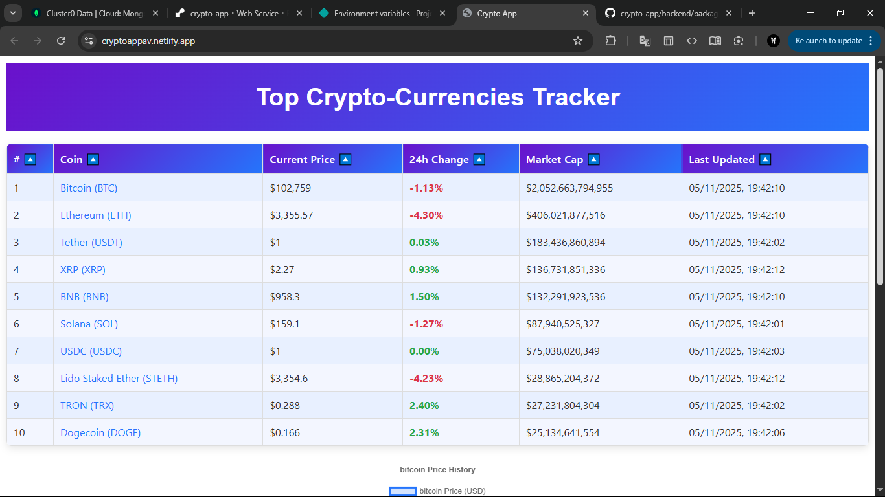
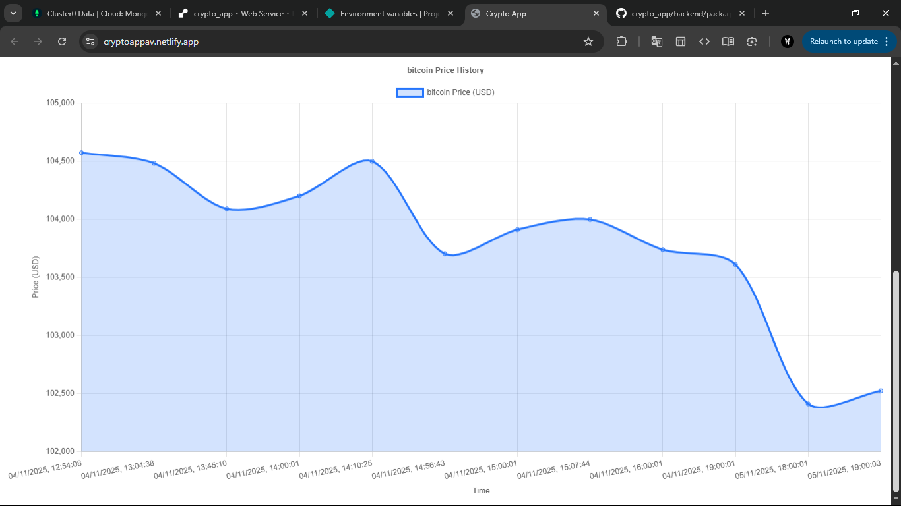
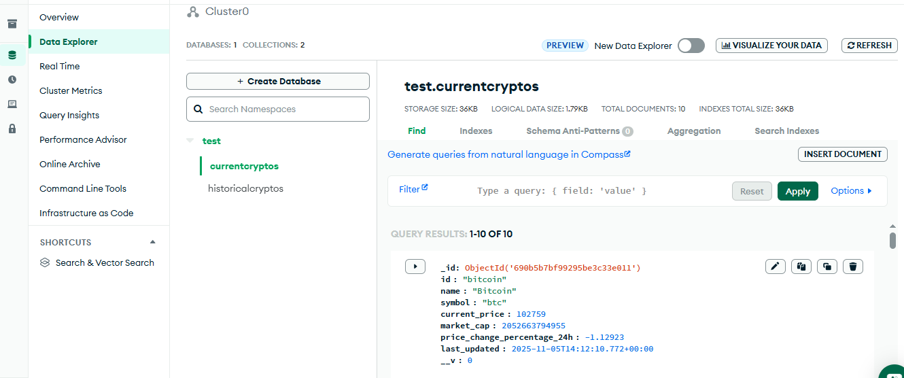
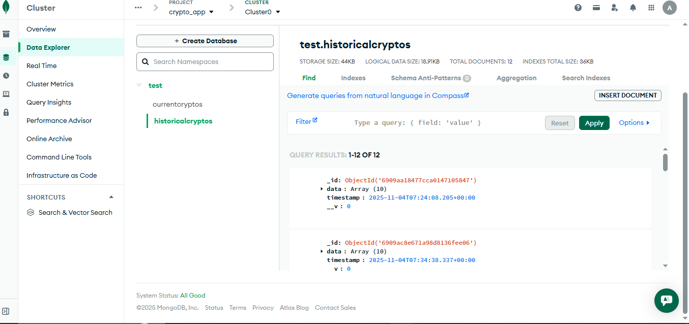
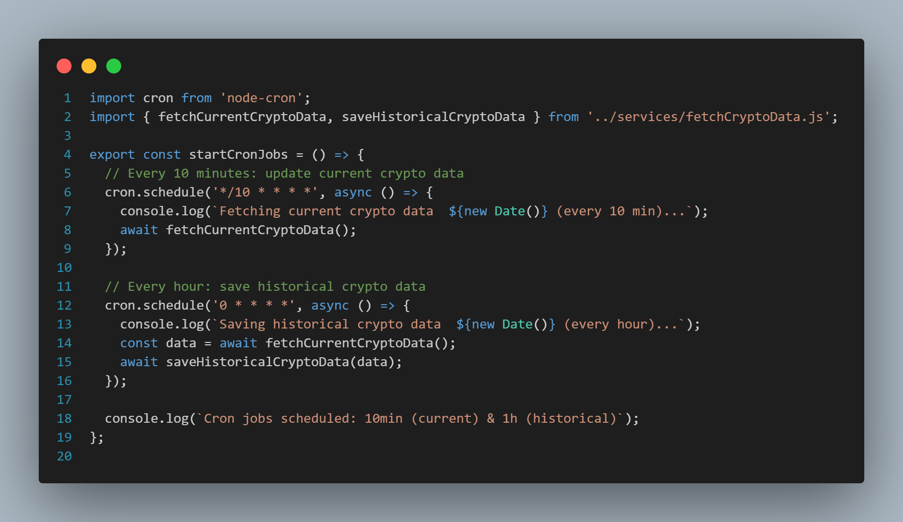

# Crypto Tracker App

A **full-stack cryptocurrency tracker** built with React, Node.js, Express, and MongoDB.  
The app fetches live crypto data from the CoinGecko API, displays it in a React dashboard, stores it in a database, and updates data automatically every 10min and every-hour using a cron job.


## 🚀 Features

- Displays **top 10 cryptocurrencies** with:
  - `Currency Name`
  - `Current price`
  - `24h price change`
  - `Market capitalization`
  - `Sorting Feature`
  - `Histoical Data`(when clicked on coin name)
- Live fetching from **CoinGecko API**
- Stores **current and historical data** in MongoDB
- **Scheduled cron job** updates the database every 10min & 1-hour
- Clean and responsive React dashboard

Frontend runs on [https://cryptoappav.netlify.app](https://cryptoappav.netlify.app)
---
Backend runs on [https://crypto-app-u7rb.onrender.com](https://crypto-app-u7rb.onrender.com)
---


## 🛠 Tech Stack

**Frontend:**  
- React.js 
- axios
- chart.js & react-chartjs  
- CSS  

**Backend:**  
- Node.js  
- Express.js  
- Axios (for API calls)  
- node-cron (for scheduled tasks)  
- mongoose & mongodb
- CORS & dotenv  

**Database:**  
- MongoDB


## ⚙️ Cron Job Explanation

The backend includes a **cron job** that runs **every hour** using `node-cron`.  

- It automatically calls the `CoinGecko API`.  
- Fetches the latest crypto prices and market data `every 10min`.  
- Stores the latest data in the `CurrentCrypto` collection.  
- Appends historical snapshots to `HistoricalCrypto` for trend tracking.  

This ensures the frontend always displays up-to-date information without manual intervention.


## ⚡ Installation

### Backend

```bash
cd backend
npm install
# setup .env
npm run dev
```


### Frontend

```bash
cd frontend
npm install
npm start
```


## 🛠 API Endpoints

The backend exposes the following endpoints:

### 1️⃣ Get Current Top Cryptocurrencies

**Endpoint:**  GET /api/cryptos

**Description:**  
Returns the latest data for the top cryptocurrencies stored in the `CurrentCrypto` collection.  
This includes:
- `id` — coin identifier
- `name` — coin name
- `symbol` — coin symbol
- `current_price` — latest price in USD
- `market_cap` — market capitalization
- `price_change_percentage_24h` — 24-hour price change percentage

**Example Response:**
```json
[
[
    {
        "_id": "690b515b69c295516626a3e5",
        "id": "bitcoin",
        "name": "Bitcoin",
        "symbol": "btc",
        "current_price": 102522,
        "market_cap": 2044512432188,
        "price_change_percentage_24h": -1.11875,
        "last_updated": "2025-11-05T13:29:41.331Z",
        "__v": 0
    },
  ...
]
```
### 2️⃣Get Historical Data for a Coin

**Endpoint:**  GET /api/historical/:coinid

**Description:**  
Fetches historical snapshots for a specific cryptocurrency stored in the `HistoricalCrypto` collection.
Replace :`coinid` with the coin's `id` (e.g., `bitcoin`).
- `id` — coin identifier
- `name` — coin name
- `symbol` — coin symbol
- `current_price` — latest price in USD
- `market_cap` — market capitalization
- `price_change_percentage_24h` — 24-hour price change percentage
- `timestamp` — time

**Example Response:**
```json
[
    {
        "id": "bitcoin",
        "name": "Bitcoin",
        "symbol": "btc",
        "current_price": 104572,
        "market_cap": 2086033954479,
        "price_change_percentage_24h": -2.84248,
        "timestamp": "2025-11-04T07:24:08.205Z"
    },
  ...
]

```

## 📸 Screenshots

*(Add screenshots of your React dashboard here)*
### Dashboard React :- (Crpto Table)

### Dashboard React :- (Historical Data)

### Dashboard MongoDB :-(Current Data)

### Dashboard MongoDB :-(Historical Data)


### Cron Job Code


## 👤 Author

**Avinash**
